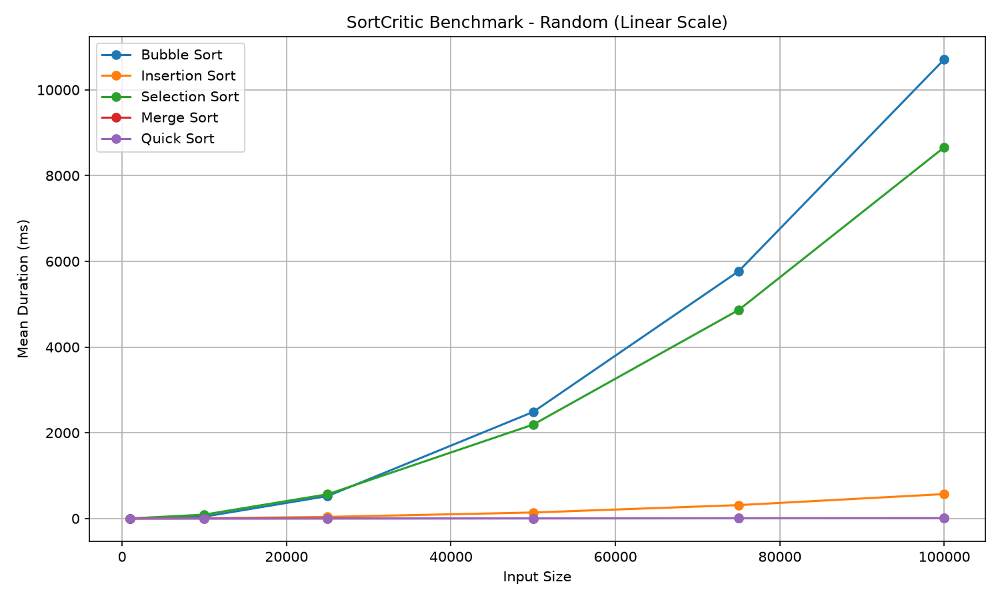
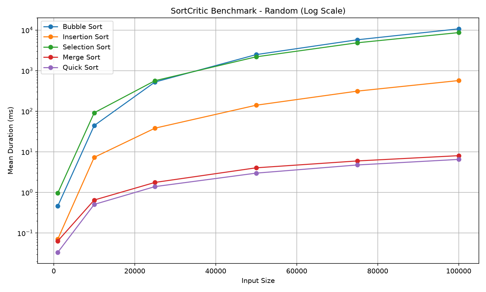
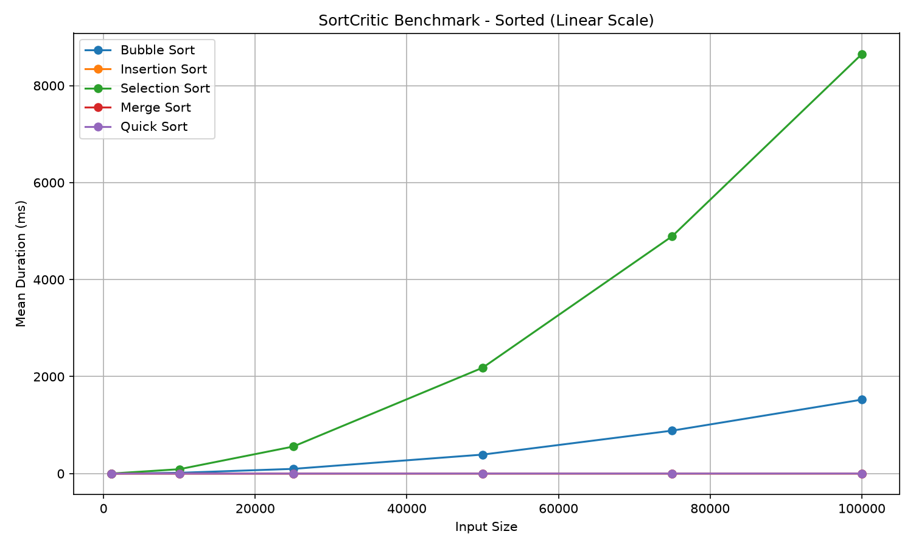
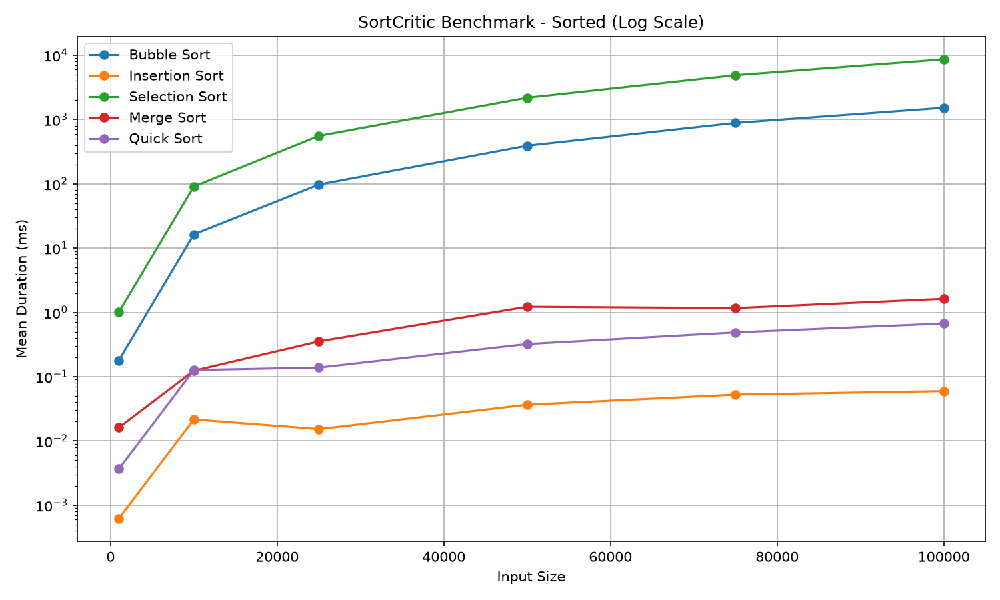
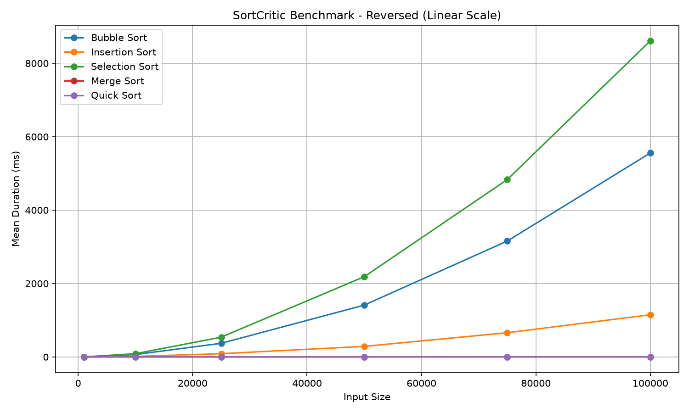
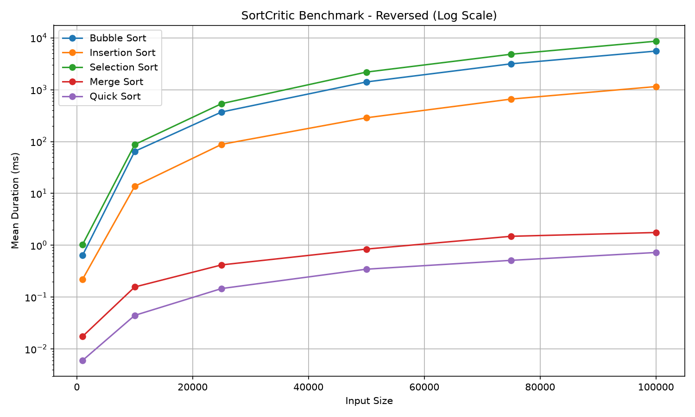

# SortCritic

SortCritic is an experimental C++ project for implementing, benchmarking, and eventually visualizing sorting algorithms on Windows.

The current **v0.1 Benchmark Prototype** focuses on reproducible CPU benchmarking across different input distributions and visualizing the measured results.

> **Status:** Paused after completing the v0.1 Benchmark Prototype.

---

## v0.1 Features

### Sorting Algorithms

- Bubble Sort
- Insertion Sort
- Selection Sort
- Merge Sort
- Quick Sort

All algorithms use a common sorting interface and are verified against `std::sort`.

### Input Distributions

- Random
- Sorted
- Reversed

Each distribution is generated from the same seeded value set so that the benchmark primarily reflects differences in input ordering.

### Benchmark

- C++ benchmark runner
- `std::chrono::steady_clock` based timing
- Fixed seed using `std::mt19937`
- Multiple input sizes
- Repeated measurements
- Mean / Median / Min / Max statistics
- Correctness verification for every run
- CSV result export
- Release x64 benchmark execution

Input generation, copying, and correctness verification are excluded from the measured sorting interval.

### Result Visualization

Benchmark CSV files are processed with Python using `pandas` and `matplotlib`.

For each input distribution, SortCritic generates:

- Linear-scale execution time graph
- Log-scale execution time graph

---

## Benchmark Results

### Random

| Linear Scale | Log Scale |
| --- | --- |
|  |  |

### Sorted

| Linear Scale | Log Scale |
| --- | --- |
|  |  |

### Reversed

| Linear Scale | Log Scale |
| --- | --- |
|  |  |

The raw CSV files used to generate these plots are included in:

```text
docs/benchmark/results/
```

---

## Repository Structure

```text
SortCritic/
├─ docs/
│  └─ benchmark/
│     ├─ plots/
│     │  ├─ benchmark_random_linear.png
│     │  ├─ benchmark_random_log.png
│     │  ├─ benchmark_sorted_linear.png
│     │  ├─ benchmark_sorted_log.png
│     │  ├─ benchmark_reversed_linear.png
│     │  └─ benchmark_reversed_log.png
│     └─ results/
│        └─ benchmark_*.csv
├─ SortCritic/
│  └─ results/
├─ plot_benchmarks.py
├─ SortCritic.sln
└─ README.md
```

`SortCritic/results/` is used as the working output directory and can remain excluded from Git.  
The v0.1 benchmark artifacts selected for documentation are copied to `docs/benchmark/`.

---

## Generating Benchmark Plots

The plotting script can be executed with [uv](https://docs.astral.sh/uv/) without maintaining a separate Python environment.

```powershell
uv run --with pandas --with matplotlib plot_benchmarks.py
```

The script reads benchmark CSV files from:

```text
SortCritic/results/
```

and generates plots under:

```text
SortCritic/results/plots/
```

For the documented v0.1 results, the final CSV files and plots are copied to:

```text
docs/benchmark/results/
docs/benchmark/plots/
```

---

## Future Directions

The original scope of SortCritic remains open for future experimentation.

Potential extensions include:

- Additional sorting algorithms
- Comparison / Swap / Write operation counting
- Interactive sorting visualization
- Algorithm race mode
- Nearly Sorted and Many Duplicates distributions
- CPU / GPU sorting experiments
- Windows GUI integration
- Standalone Windows build

These are possible future directions rather than committed features.

---

## Benchmark Limitations

SortCritic is not intended to be a general-purpose hardware benchmark.

Measured execution time can be affected by:

- Algorithm implementation
- Compiler and optimization settings
- CPU architecture and cache behavior
- Memory performance
- Operating system scheduling
- Background processes
- Input characteristics

Benchmark results should therefore be interpreted within the documented test conditions.

---

## Tech Stack

- C++
- Visual Studio
- C++ Standard Library
- `std::chrono`
- `std::mt19937`
- Python
- pandas
- matplotlib
